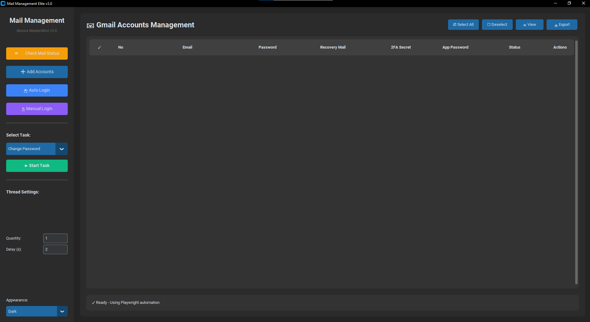
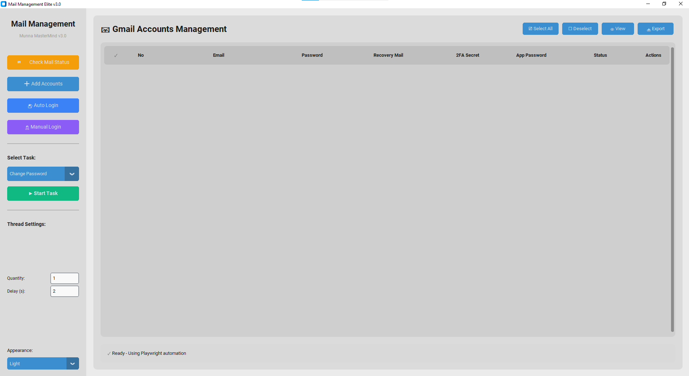

<!-- Modern Stats Cards -->

    <h1 align="center">
    
  </h1>
  

---

# AutoGuard - Advanced AntiDetect Browser

  

<h3 align="center">
    👉 <a href="https://mailmanagement.vercel.app/" target="_blank">Vercel Link</a> 🚀   
    👉 <a href="https://mailmanager.netlify.app/" target="_blank">Netlify Link</a> 🚀
</h3>

## Legitimate use & responsibility

Autoguard is a tool for **legitimate multi-account management**: marketing agencies
handling many client ad accounts, QA and ad-verification testing, web-automation
development, and privacy research — the same use cases served openly by
commercial anti-detect browsers.

Do **not** use it for fraud, credential stuffing, spam, evading bans you've
earned, or anything that violates a site's terms of service or the law. You are
responsible for how you use it.

---

# ❤️ Support My Project  

If my project help you, please ⭐ star my repos —  
It motivates me to build **more awesome systems**!

---

<!--Code Developed by Munna MasterMind-->